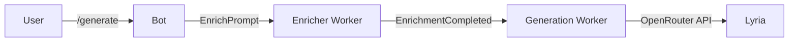

---

## 🔴 **Критические проблемы (BLOCKER)**

### **TASK-001: Race condition в save_feedback — потеря пользовательских оценок**
**Приоритет:** BLOCKER  
**Метка:** bug, data-loss

**Проблема:**  
В `domains/feedback/service.py::save_feedback()` [18] есть классическая гонка между `SELECT` и `INSERT`:

```python
feedback_result = await session.execute(
    select(GenerationFeedback).where(GenerationFeedback.generation_id == generation.id).limit(1)
)
record = feedback_result.scalar_one_or_none()
if record is None:
    record = GenerationFeedback(generation_id=generation.id)
    session.add(record)
```

Если два воркера/хендлера одновременно обработают фидбек для одной генерации, оба не найдут запись → оба создадут новую → `IntegrityError` на уникальном ключе `generation_id`. Отзыв мамы улетит в `/dev/null`, в логах будет SQLAlchemyError.

**Аналогия из твоей области:**  
Как если бы два мастера одновременно решили, что шлейф дисплея не подключён, и оба начали его припаивать. Один спалит контакты, второй — плату. Нужен семафор или `INSERT ... ON CONFLICT`.

**Решение:**  
Используй PostgreSQL `INSERT ... ON CONFLICT DO UPDATE` через SQLAlchemy 2.0:

```python
from sqlalchemy.dialects.postgresql import insert

stmt = insert(GenerationFeedback).values(
    generation_id=generation.id,
    is_liked=evalue,
    feedback=feedback,
).on_conflict_do_update(
    index_elements=['generation_id'],
    set_={'is_liked': evalue, 'feedback': feedback}
)
await session.execute(stmt)
await session.commit()
```

Альтернатива: оберни в `with_for_update()` при SELECT, но это медленнее и блокирует строку.

**DoD:**
- [ ] Заменить SELECT+INSERT на upsert через `on_conflict_do_update`
- [ ] Добавить уникальный индекс на `generation_id` в миграцию (если его нет)
- [ ] Написать unit-тест с двумя конкурентными вызовами `save_feedback()` для одного `gen_id`
- [ ] Проверить, что второй вызов не роняет транзакцию

---

### **TASK-002: Отсутствие индексов на горячих запросах — тормоза и дедлоки**
**Приоритет:** BLOCKER  
**Метка:** performance, database

**Проблема:**  
В `save_feedback()` [18] идёт запрос:

```python
select(Generation).where(
    Generation.user_id == user_id,
    Generation.status == GenerationStatus.SUCCESS,
).order_by(Generation.created_at.desc(), Generation.id.desc()).limit(1)
```

Индекса на `(user_id, status, created_at)` нет → PostgreSQL делает полный скан `generations` на каждый фидбек. При 1000+ генераций это секунды, плюс блокировки строк при сортировке.

**Аналогия:**  
Как искать неисправный конденсатор на плате без схемы — придётся прозвонить всё подряд. Нужна карта (индекс).

**Решение:**  
Создай композитный индекс в новой миграции:

```python
# alembic revision
op.create_index(
    'ix_generations_user_status_created',
    'generations',
    ['user_id', 'status', 'created_at'],
    postgresql_where=sa.text("status = 'success'")  # partial index
)
```

Также проверь индексы на:
- `generations.user_id` (уже есть по [1])
- `generation_feedbacks.generation_id` (уже есть по [1])

**DoD:**
- [ ] Создать миграцию с композитным индексом `(user_id, status, created_at)`
- [ ] Добавить partial index на `status='success'` (экономит место)
- [ ] Прогнать `EXPLAIN ANALYZE` на запрос после миграции — должен быть Index Scan, а не Seq Scan
- [ ] Обновить документацию по индексам (если есть)

---

### **TASK-003: Незащищённая отмена генерации — деньги улетают в трубу**
**Приоритет:** BLOCKER  
**Метка:** bug, money-loss

**Проблема:**  
В `domains/generation/worker.py::run_generation_task()` [11] отмена через `is_generation_cancelled()` проверяется только внутри `on_progress()`:

```python
async def on_progress(stage: str, fraction: float) -> None:
    if await is_generation_cancelled(gen_id=command.gen_id):
        raise asyncio.CancelledError
```

Но OpenRouter **уже начал генерацию** и спишет деньги, даже если воркер бросит `CancelledError`. Cancel-token проверяется только между SSE-чанками, **после** POST-запроса. Ты платишь за каждую генерацию ~$1, а мама может случайно нажать «Отмена» — деньги спишутся, аудио не придёт.

**Аналогия:**  
Как паять BGA-чип и отключить фен на середине — флюс уже прогрет, шарики оплавились, но чип не сел. Плата испорчена, деньги за работу списаны, клиент недоволен.

**Решение:**  
1. Проверяй cancel-token **ДО** вызова OpenRouter API:
   ```python
   if await is_generation_cancelled(gen_id=command.gen_id):
       raise asyncio.CancelledError
   
   async with client.stream(...) as resp:
       ...
   ```

2. После отмены выставляй статус `CANCELLED` в БД **до** очистки токена, иначе повторный запрос может стартовать вторую генерацию.

3. Добавь мягкую отмену: вместо `CancelledError` помечай задачу как `cancelled=True`, дожидайся завершения потока и **не отправляй аудио**. OpenRouter всё равно вернёт файл, но хотя бы не будет обрыва соединения.

**DoD:**
- [ ] Переместить проверку `is_generation_cancelled()` ДО POST-запроса в OpenRouter
- [ ] Обернуть блок генерации в try/except CancelledError с установкой статуса CANCELLED
- [ ] Написать интеграционный тест: установить cancel-token → запустить воркер → убедиться, что запрос в API не ушёл
- [ ] Логировать отмены с уровнем WARNING (для аналитики потерь)

---

## 🟠 **Высокий приоритет (HIGH)**

### **TASK-004: Утечка Bot-сессий в event-хендлерах воркеров**
**Приоритет:** HIGH  
**Метка:** bug, resource-leak

**Проблема:**  
В `domains/enricher/handlers.py::handle_enrichment_completed_event()` и `handle_generation_failed_event()` [5] создаётся новый `Bot(token=...)` в каждом вызове:

```python
bot = Bot(token=settings.bot.BOT_TOKEN)
try:
    # ...
finally:
    await bot.session.close()
```

Если воркер упадёт между `Bot()` и `finally` (например, KeyboardInterrupt или OOM), HTTP-сессия `aiohttp.ClientSession` останется открытой → утечка сокетов. При 1000 генераций в день и 0.1% сбоев это 1 утечка в день, через неделю VPS начнёт задыхаться от `Too many open files`.

**Аналогия:**  
Как не выключить паяльник после работы — через час он прожжёт стол, через день устроит пожар. Нужен таймер или автоматика.

**Решение:**  
Используй `TelegramPort` из контекста TaskIQ (как в `run_generation_task()` [11]):

```python
async def handle_enrichment_completed_event(
    event: EnrichmentCompleted,
    context: Context = TaskiqDepends(),
) -> None:
    telegram: TelegramPort = context.state["telegram_port"]
    storage: RedisStorage = context.state["storage"]
    bot: Bot = context.state["bot"]
    # bot уже создан в main, закроется при shutdown
```

Либо оберни в `async with`:
```python
async with Bot(token=...) as bot:
    # сессия закроется даже при исключении
```

**DoD:**
- [ ] Переписать `handle_enrichment_completed_event()` и `handle_generation_failed_event()` на использование `TelegramPort` из контекста
- [ ] Удалить ручное создание `Bot()` в event-хендлерах
- [ ] Добавить в `conftest.py` фикстуру для проверки утечек (например, счётчик открытых сессий)
- [ ] Прогнать тесты с `pytest-asyncio` и `pytest-aioresponses` для проверки cleanup

---

### **TASK-005: Отсутствие retry-логики для транзиентных ошибок OpenRouter**
**Приоритет:** HIGH  
**Метка:** reliability, enhancement

**Проблема:**  
В `generate_song_real()` [18] любой HTTP-сбой (503, timeout, разрыв TCP) роняет генерацию насмерть:

```python
if resp.status_code != 200:
    raise GenerationAPIError(...)
```

OpenRouter может временно лагать (503 Service Unavailable, 429 Rate Limit), но ты не делаешь retry. Мама получит «Ошибка генерации», хотя через 5 секунд всё бы заработало. Это особенно критично для $1 за генерацию — потеря денег без результата.

**Решение:**  
Используй `tenacity` (уже в проекте через Poetry):

```python
from tenacity import (
    retry,
    stop_after_attempt,
    wait_exponential,
    retry_if_exception_type,
)

@retry(
    stop=stop_after_attempt(3),
    wait=wait_exponential(multiplier=1, min=2, max=10),
    retry=retry_if_exception_type((httpx.TimeoutException, httpx.ConnectError)),
    reraise=True,
)
async def generate_song_real(...):
    ...
```

Для 429/503 добавь кастомный retry:
```python
def is_retryable_status(exception):
    if isinstance(exception, GenerationAPIError):
        return "503" in str(exception) or "429" in str(exception)
    return False
```

**DoD:**
- [ ] Добавить `@retry` декоратор на `generate_song_real()` с экспоненциальным backoff
- [ ] Настроить retry на: `TimeoutException`, `ConnectError`, 429, 503
- [ ] Логировать каждую попытку retry с уровнем WARNING
- [ ] Написать unit-тест с мокированием 503 → 503 → 200
- [ ] Обновить `CONVENTIONS.md` [15] с правилами retry для внешних API

---

### **TASK-006: Type hints отсутствуют в критичных местах**
**Приоритет:** HIGH  
**Метка:** tech-debt, type-safety

**Проблема:**  
Несколько функций без типов или с `Any`:
- `_find_audio_b64(node: Any)` [18] — рекурсивный обход JSON, `Any` скрывает ошибки
- `make_throttled_progress(report: Callable[[str], Awaitable[None]])` [18] — не хватает generic-типов

Mypy (если включишь strict mode) будет орать. Это затруднит рефакторинг и может привести к runtime-ошибкам при смене контрактов.

**Решение:**  
```python
from typing import TypeAlias

JSONValue: TypeAlias = dict[str, "JSONValue"] | list["JSONValue"] | str | int | float | bool | None

def _find_audio_b64(node: JSONValue) -> str | None:
    ...
```

Для `report`:
```python
from collections.abc import Callable

ProgressReporter: TypeAlias = Callable[[str], Awaitable[None]]

def make_throttled_progress(report: ProgressReporter) -> ProgressCallback:
    ...
```

**DoD:**
- [ ] Добавить `JSONValue` type alias в `core/types.py` (создать если нет)
- [ ] Пройтись по всем `Any` в проекте и заменить на конкретные типы
- [ ] Включить `mypy` в `pyproject.toml` [15] с `strict = true`
- [ ] Прогнать `mypy src/` и исправить все ошибки
- [ ] Добавить pre-commit hook с mypy (если ещё не стоит)

---

## 🟡 **Средний приоритет (MEDIUM)**

### **TASK-007: Хрупкий парсинг SSE — сломается при изменении формата OpenRouter**
**Приоритет:** MEDIUM  
**Метка:** tech-debt, fragility

**Проблема:**  
В `_parse_openrouter_sse()` [18] ты парсишь SSE вручную через `aiter_lines()`:

```python
raw_payload = line.split(":", 1)[1].strip()
choices = chunk.get("choices") or [{}]
delta = choices[0].get("delta", {})
audio = delta.get("audio") or {}
```

Проблемы:
1. Если OpenRouter добавит поле `event: audio_chunk`, твой парсер проигнорирует его.
2. Fallback на `[{}]` и `or {}` скрывает реальные ошибки формата.
3. Нет валидации структуры чанка через Pydantic → runtime-ошибки вместо явного контракта.

**Решение:**  
1. Используй библиотеку `httpx-sse` для парсинга SSE:
   ```python
   from httpx_sse import aconnect_sse
   
   async with aconnect_sse(client, "POST", url, json=payload) as event_source:
       async for sse in event_source.aiter_sse():
           if sse.event == "audio_chunk":
               chunk = json.loads(sse.data)
   ```

2. Добавь Pydantic-модель для чанка:
   ```python
   class OpenRouterDelta(BaseModel):
       audio: dict[str, str] | None = None
   
   class OpenRouterChoice(BaseModel):
       delta: OpenRouterDelta
   
   class OpenRouterChunk(BaseModel):
       choices: list[OpenRouterChoice]
   ```

**DoD:**
- [ ] Добавить `httpx-sse` в `pyproject.toml`
- [ ] Создать `domains/generation/schemas.py` с Pydantic-моделями для OpenRouter SSE
- [ ] Переписать `_parse_openrouter_sse()` на `httpx_sse`
- [ ] Заменить fallback `or {}` на явный `ValidationError`
- [ ] Написать unit-тест с некорректным форматом SSE → должен упасть с понятной ошибкой

---

### **TASK-008: Отсутствие graceful shutdown для воркеров**
**Приоритет:** MEDIUM  
**Метка:** ops, reliability

**Проблема:**  
В `entrypoint.sh` [19] и `bot.py` [6] нет обработки SIGTERM для воркеров. При `docker-compose down` или `kubectl delete pod` Docker шлёт SIGTERM → через 10 секунд SIGKILL → генерация обрывается на середине, статус остаётся `PENDING`, деньги списаны, аудио не сохранено.

**Аналогия:**  
Как выдернуть паяльник из розетки прямо во время пайки — капля припоя застынет криво, контакт будет ненадёжным, придётся перепаивать.

**Решение:**  
1. Добавь в воркеры обработчик SIGTERM:
   ```python
   import signal
   
   shutdown_event = asyncio.Event()
   
   def handle_sigterm(signum, frame):
       shutdown_event.set()
   
   signal.signal(signal.SIGTERM, handle_sigterm)
   
   # В run_generation_task():
   if shutdown_event.is_set():
       raise asyncio.CancelledError
   ```

2. В `docker-compose.yml` увеличь `stop_grace_period`:
   ```yaml
   services:
     generation-worker:
       stop_grace_period: 3m  # Запас на завершение генерации
   ```

3. В воркере помечай генерацию как `PENDING` при SIGTERM, чтобы можно было retry.

**DoD:**
- [ ] Добавить обработчик SIGTERM в `core/lifecycle.py` [8]
- [ ] Прокинуть `shutdown_event` в воркеры через TaskIQ state
- [ ] Увеличить `stop_grace_period` в `docker-compose.yml` до 3 минут
- [ ] Написать интеграционный тест: послать SIGTERM → убедиться, что генерация завершилась с `CANCELLED`
- [ ] Добавить в логи `Received SIGTERM, finishing current tasks...`

---

### **TASK-009: Отсутствие мониторинга и алертов**
**Приоритет:** MEDIUM  
**Метка:** ops, observability

**Проблема:**  
В проекте нет:
- Метрик (Prometheus, StatsD)
- Трейсинга (OpenTelemetry, Sentry)
- Алертов на критичные события (генерация зафейлилась, очередь заполнена, Redis недоступен)

Если OpenRouter ляжет или RabbitMQ переполнится, ты узнаешь об этом только когда мама напишет «бот не работает». Для продакшна с живыми деньгами это недопустимо.

**Решение:**  
1. Добавь Sentry для отлова ошибок:
   ```python
   import sentry_sdk
   sentry_sdk.init(dsn=settings.SENTRY_DSN, traces_sample_rate=0.1)
   ```

2. Добавь Prometheus-метрики через `prometheus-client`:
   ```python
   from prometheus_client import Counter, Histogram
   
   generation_counter = Counter('generations_total', 'Total generations', ['status'])
   generation_duration = Histogram('generation_duration_seconds', 'Generation duration')
   ```

3. Настрой алерты в Grafana/Alertmanager:
   - `generation_failed_rate > 10%` → Telegram/email
   - `rabbitmq_queue_depth > 100` → Telegram
   - `redis_connection_errors > 0` → PagerDuty

**DoD:**
- [ ] Добавить `sentry-sdk` в `pyproject.toml`
- [ ] Создать `core/observability.py` с инициализацией Sentry
- [ ] Добавить `prometheus-client` и экспортёр метрик в `/metrics`
- [ ] Настроить дашборд в Grafana (если есть инфра)
- [ ] Написать документацию по метрикам в `docs/monitoring.md`

---

### **TASK-010: Захардкоженные константы разбросаны по коду**
**Приоритет:** MEDIUM  
**Метка:** tech-debt, config

**Проблема:**  
В `service.py` [18]:
```python
PROGRESS_EDIT_INTERVAL = 3.0
LOCK_TTL_MS = 180_000
MAX_AUDIO_B64_LEN = 40 * 1024 * 1024
```

Эти значения должны быть в `config.py` [17] с возможностью переопределения через `.env`. Сейчас, чтобы увеличить TTL лока, нужно лезть в код и передеплоить.

**Решение:**  
Вынеси в `GenerationConfig`:
```python
class GenerationConfig(BaseModelConfig):
    SONG_PRICE: float
    MOCK_MODE: bool = False
    MOCK_FILE: str = ""
    TYPICAL_GENERATION_SECONDS: float = 30.0
    PROGRESS_EDIT_INTERVAL: float = 3.0
    LOCK_TTL_SECONDS: int = 180
    MAX_AUDIO_MB: int = 40
```

В `service.py`:
```python
PROGRESS_EDIT_INTERVAL = settings.generation.PROGRESS_EDIT_INTERVAL
```

**DoD:**
- [ ] Перенести все константы из `service.py` в `GenerationConfig`
- [ ] Создать `.env.example` (если нет) с комментариями к новым переменным
- [ ] Обновить `README.md` с описанием всех env-переменных
- [ ] Прогнать тесты — убедиться, что значения по умолчанию не сломали логику

---

## 🟢 **Низкий приоритет (LOW)**

### **TASK-011: Отсутствует логирование структурированных событий**
**Приоритет:** LOW  
**Метка:** enhancement, observability

**Проблема:**  
Логи в формате plain-text [16]:
```python
log.info("Enrichment result delivered (user=%s)", event.user_id)
```

В продакшне удобнее JSON-логи для парсинга в ELK/Loki:
```json
{"level": "info", "event": "enrichment_completed", "user_id": 123, "gen_id": 456}
```

**Решение:**  
Используй `structlog`:
```python
import structlog
log = structlog.get_logger()
log.info("enrichment_completed", user_id=event.user_id, gen_id=event.gen_id)
```

**DoD:**
- [ ] Добавить `structlog` в `pyproject.toml`
- [ ] Настроить JSON-рендерер в `core/logging.py`
- [ ] Переписать 10-15 самых частых `log.info()` на structlog
- [ ] Добавить в `CONVENTIONS.md` [15] правило: использовать structlog для бизнес-событий

---

### **TASK-012: Нет pre-commit hooks для линтеров**
**Приоритет:** LOW  
**Метка:** dx, automation

**Проблема:**  
В `pyproject.toml` [15] настроены ruff, mypy, но нет автоматической проверки перед коммитом. Можно закоммитить код с ошибками форматирования → CI упадёт → лишний цикл фидбека.

**Решение:**  
Добавь `.pre-commit-config.yaml`:
```yaml
repos:
  - repo: https://github.com/astral-sh/ruff-pre-commit
    rev: v0.3.0
    hooks:
      - id: ruff
        args: [--fix]
      - id: ruff-format
  - repo: https://github.com/pre-commit/mirrors-mypy
    rev: v1.9.0
    hooks:
      - id: mypy
```

**DoD:**
- [ ] Создать `.pre-commit-config.yaml`
- [ ] Добавить `pre-commit` в `pyproject.toml` dev-dependencies
- [ ] Прописать в `README.md` инструкцию: `pre-commit install`
- [ ] Прогнать `pre-commit run --all-files` и исправить ошибки

---

### **TASK-013: Отсутствует документация по архитектуре**
**Приоритет:** LOW  
**Метка:** docs

**Проблема:**  
Нет `docs/architecture.md` с описанием:
- Схемы взаимодействия доменов (enricher → generation → evaluation)
- Диаграммы flow пользователя
- Контрактов между модулями (commands/events)

Для собеседований это **мощный артефакт** — покажет, что ты умеешь не только писать код, но и проектировать систему.

**Решение:**  
Создай `docs/architecture.md` с разделами:
1. **High-level overview** — блок-схема: Telegram ↔ Bot ↔ Workers ↔ OpenRouter
2. **Domain breakdown** — таблица доменов с их ответственностью
3. **Event-driven flow** — sequence diagram для генерации песни
4. **Database schema** — ER-диаграмма моделей
5. **Deployment** — как это крутится на VPS (Docker Compose, порты, volumes)

Используй Mermaid для диаграмм прямо в Markdown:


**DoD:**
- [ ] Создать `docs/architecture.md` с 5 разделами
- [ ] Добавить Mermaid-диаграммы для flow и схемы БД
- [ ] Сделать скриншот диалога с ботом и вставить в docs
- [ ] Обновить `README.md` ссылкой на `docs/architecture.md`

---

## 📊 **Итоговый бэклог (Kanban-friendly)**

### **To Do**
```
🔴 TASK-001: Race condition в save_feedback
🔴 TASK-002: Отсутствие индексов на горячих запросах
🔴 TASK-003: Незащищённая отмена генерации
🟠 TASK-004: Утечка Bot-сессий в event-хендлерах
🟠 TASK-005: Отсутствие retry-логики для OpenRouter
```

### **In Progress**
```
(сюда переносишь, когда начинаешь работу)
```

### **Code Review**
```
(сюда после PR)
```

### **Done**
```
(после merge в DEV)
```

---

## 🎯 **Рекомендации по приоритизации**

1. **Начни с TASK-001** — это реальная потеря данных, баг воспроизводится легко, фикс за 30 минут.
2. **Потом TASK-003** — это про деньги, самое болезненное место.
3. **Затем TASK-002** — индексы можно накатить без простоя через `CREATE INDEX CONCURRENTLY`.
4. **TASK-004 и TASK-005** — перед масштабированием на платных пользователей.
5. **Остальные** — по мере необходимости, но **TASK-013 (документация)** очень поможет на собеседованиях.

---

**Влад, держи эти карточки как есть — копируй в свой канбан.** Если нужны правки или хочешь обсудить какую-то задачу подробнее — пиши, разберём. Проект реально крепкий, но пара острых углов может выстрелить в продакшне — давай их сгладим до того, как это случится.
